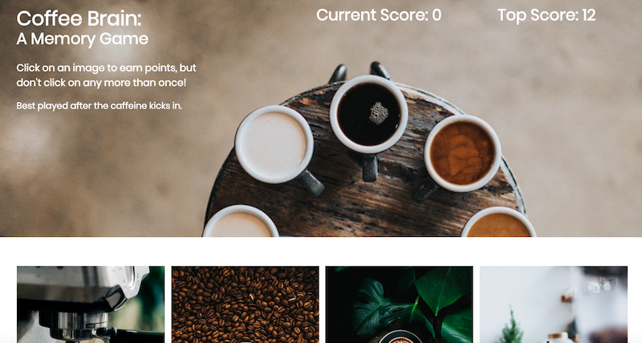

# Coffee Brain 
This is a memory game that was built using React. The goal of the game is to achieve the top score by selecting every image once. If you choose an image twice, the game will reset to zero. 

To run the game locally, download the repository and run it in your terminal. By running npm start, you can visit localhost:3000, and play the game!

For an web version, you can also play the game [here](https://boiling-refuge-85146.herokuapp.com/) !

# Technologies Used
* React
* ES6
* Bootstrap
* CSS
* Node.js / Express
* Heroku

# Preview

# Copyright

Kaitlyn McLaughlin &copy; 2019
